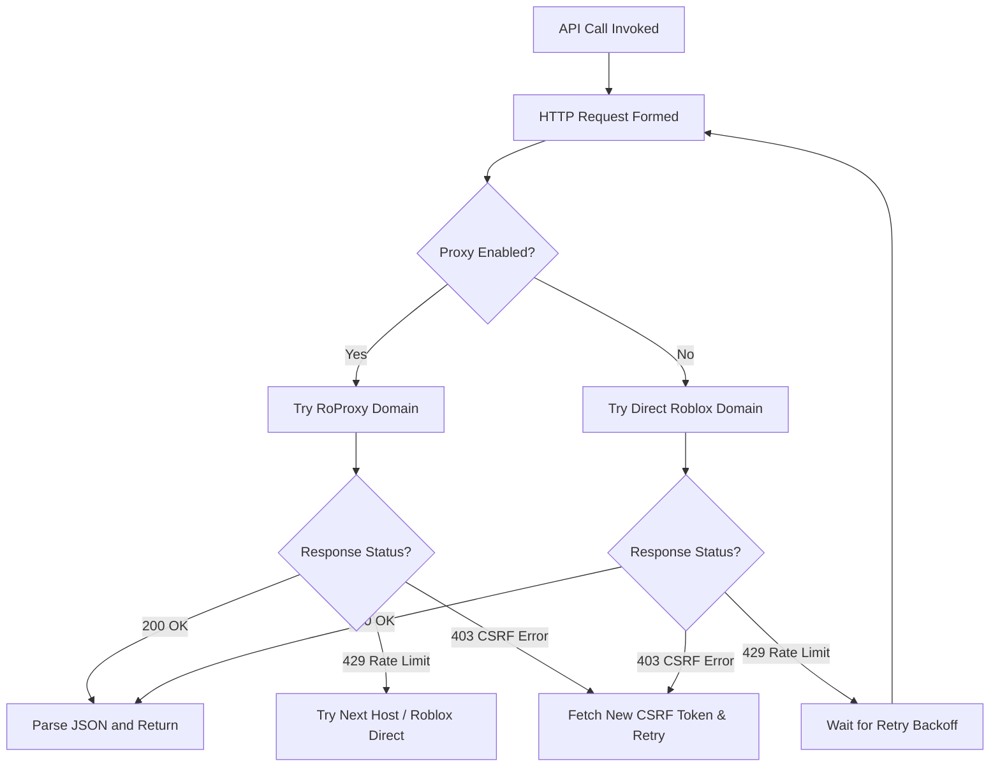

# robloxian-api

<p align="center">
  
  
  
  
</p>

An advanced, enterprise-grade, lightweight Roblox API wrapper for Node.js. Featuring a robust proxy failover architecture, automatic CSRF token management, HTTP 429 rate-limit backoffs, and native TypeScript declarations. Optimized for high-concurrency Discord bots and web applications.

Authored with respect by **[NeuzGG](https://github.com/NeuzGG)**.

---

## Table of Contents
1. [Key Features](#key-features)
2. [How It Works (Under the Hood)](#how-it-works-under-the-hood)
3. [Installation](#installation)
4. [Authentication Setup](#authentication-setup)
5. [Usage Guide](#usage-guide)
   * [Functional API Shorthand](#1-functional-api-shorthand)
   * [Multi-Instance RobloxClient](#2-multi-instance-robloxclient)
   * [Discord.js Integration Template](#3-discordjs-integration-template)
6. [API Reference Directory](#api-reference-directory)
7. [TypeScript Support](#typescript-support)
8. [Troubleshooting & FAQ](#troubleshooting--faq)
9. [License](#license)

---

## Key Features

*   **Zero External Dependencies** - Written entirely in pure JS utilizing native Node.js `fetch` (Node.js 18+).
*   **Failover Proxy Engine** - Automatically detects network issues or rate limits on proxies (like RoProxy) and seamlessly falls back to direct Roblox API hosts.
*   **Intelligent Rate-Limit Throttling** - Captures HTTP `429 (Too Many Requests)` rate-limiting and applies exponential backoff delays.
*   **Automated CSRF Token Handshaking** - Intercepts Roblox `403 Forbidden` token validations, automatically retrieves the fresh token, caches it, and retries the request transparently.
*   **Structured Modules** - Separated logically into distinct services (Gamepasses, Users, Groups, Badges, Catalog, and Games) for readability.

---

## How It Works (Under the Hood)

Whenever you dispatch an API call (e.g., check gamepass ownership or verify group roles), the query routes through our unified HTTP engine:



---

## Installation

Install `robloxian-api` in your Node.js project:

```bash
npm install robloxian-api
```

Ensure you are using **Node.js version 18.0.0** or higher.

---

## Authentication Setup

Some endpoints (such as checking private inventories, fetching user Robux balances, or updating assets) require cookie authentication.

1. Go to [Roblox.com](https://www.roblox.com) and log in.
2. Open your browser's developer tool console (F12 or inspect).
3. Go to the **Application** tab (Chrome/Edge) or **Storage** tab (Firefox).
4. Expand **Cookies** on the left menu and select `https://www.roblox.com`.
5. Locate the cookie named **`.ROBLOSECURITY`** and copy its full value.
6. Create a `.env` file in the root of your application:

```env
# Roblox Authentication Security Cookie
ROBLOX_COOKIE=_|WARNING:-Secure-Cookie-Value-Here...

# Logging Level: debug, info, warn, error, none (Default: info)
LOG_LEVEL=info
```

> [!WARNING]
> Keep your `.ROBLOSECURITY` cookie secret. Never commit it to GitHub or share it with anyone.

---

## Usage Guide

### 1. Functional API Shorthand
Perfect for quick scripts or when you only run a single account using environment variables:

```javascript
const { fetchRobloxUser, checkUserOwnsGamepass } = require('robloxian-api');

(async () => {
  // Resolve Roblox username to details
  const user = await fetchRobloxUser('Shedletsky');
  if (user) {
    console.log(`Resolved: ${user.displayName} (ID: ${user.id})`);
    
    // Check if the user owns a gamepass (requires ROBLOX_COOKIE set in .env)
    const gamepassId = 20268598;
    const ownsPass = await checkUserOwnsGamepass(user.id, gamepassId);
    console.log(`Owns Gamepass: ${ownsPass ? 'Yes' : 'No'}`);
  }
})();
```

### 2. Multi-Instance RobloxClient
Essential when managing multiple bot accounts, cookies, or separate configurations in a single runtime:

```javascript
const { RobloxClient } = require('robloxian-api');

const botClient = new RobloxClient({
  cookie: 'YOUR_ROBLOSECURITY_COOKIE',
  useProxy: true,       // Tries RoProxy first, falls back to Roblox.com
  logLevel: 'debug',     // Shows verbose proxy failovers and CSRF handshakes
  timeout: 8000,        // 8 seconds request timeout
  maxRetries: 3         // Rate limit retry limits
});

(async () => {
  // Validate cookie integrity and get Robux balance
  const session = await botClient.validateCookie();
  if (session.valid) {
    console.log(`Logged in as: ${session.username}`);
    console.log(`Balance: ${session.robux} R$`);
  }
})();
```

### 3. Discord.js Integration Template
Here is how you can use `robloxian-api` in your Discord bot to verify gamepass ownership when users trigger commands:

```javascript
const { Client, GatewayIntentBits } = require('discord.js');
const { fetchRobloxUser, checkUserOwnsGamepass } = require('robloxian-api');

const discordClient = new Client({ intents: [GatewayIntentBits.Guilds, GatewayIntentBits.GuildMessages, GatewayIntentBits.MessageContent] });

discordClient.on('messageCreate', async (message) => {
  if (message.author.bot) return;

  // Command: !verify <roblox_username>
  if (message.content.startsWith('!verify')) {
    const args = message.content.split(' ');
    const username = args[1];

    if (!username) {
      return message.reply('Please specify your Roblox username! Example: `!verify Shedletsky`');
    }

    const checkingMsg = await message.reply(`Checking database for username "${username}"...`);

    try {
      const user = await fetchRobloxUser(username);
      if (!user) {
        return checkingMsg.edit(`Roblox user "${username}" was not found!`);
      }

      // Check if they own the VIP Gamepass (replace with your Gamepass ID)
      const vipGamepassId = 20268598;
      const hasPass = await checkUserOwnsGamepass(user.id, vipGamepassId);

      if (hasPass) {
        return checkingMsg.edit(`Verification Successful! **${user.displayName}** owns the VIP Gamepass.`);
      } else {
        return checkingMsg.edit(`**${user.displayName}** does not own the required VIP Gamepass.`);
      }
    } catch (err) {
      console.error(err);
      return checkingMsg.edit('An error occurred while communicating with the Roblox API.');
    }
  }
});

discordClient.login('YOUR_DISCORD_BOT_TOKEN');
```

---

## API Reference Directory

### Gamepass Service
| Function | Parameters | Return Type | Description |
| :--- | :--- | :--- | :--- |
| `extractGamepassIds` | `(text: string)` | `Array<{id, url}>` | Parses a text string and returns all extracted gamepass IDs and links. |
| `fetchGamepassInfo` | `(id: string\|number)` | `Promise<object>` | Fetches basic gamepass details (name, price) using product info. |
| `fetchGamepassDetails`| `(id: string\|number)` | `Promise<object>` | Fetches advanced details (price, regional pricing, for-sale status). |
| `checkUserOwnsGamepass`| `(userId: string\|number, gamepassId: string\|number)` | `Promise<boolean>` | Queries user inventory to check if they own the gamepass. |

### User Service
| Function | Parameters | Return Type | Description |
| :--- | :--- | :--- | :--- |
| `fetchRobloxUser` | `(username: string)` | `Promise<object>` | Resolves username to `{ id, username, displayName }`. |
| `fetchRobloxUserAvatar`| `(userId: string\|number)`| `Promise<string>` | Retrieves the URL of the avatar headshot image. |
| `fetchUserDetails` | `(userId: string\|number)`| `Promise<object>` | Retrieves full public profile data (description, join date, ban status). |
| `fetchUserPresence` | `(userIds: number[])` | `Promise<object[]>`| Checks presence state (Online/Offline/In Game/Studio) for up to 100 users. |
| `validateCookie` | `()` | `Promise<object>` | Checks cookie status, returns user ID, username, and Robux balance. |

### Group Service
| Function | Parameters | Return Type | Description |
| :--- | :--- | :--- | :--- |
| `checkGroupMembership`| `(userId: string\|number, groupId: string\|number)` | `Promise<boolean>` | Verifies if the target user is currently in the group. |
| `fetchUserGroupRole` | `(userId: string\|number, groupId: string\|number)` | `Promise<object>` | Gets user's exact role name, role ID, and rank (0-255). |
| `fetchGroupRoles` | `(groupId: string\|number)` | `Promise<object[]>`| Lists all ranks and roles defined within the group. |
| `fetchGroupMembers` | `(groupId: string\|number, options?: object)` | `Promise<object>` | Lists group members (supports recursive lookup or page cursors). |

### Badge Service
| Function | Parameters | Return Type | Description |
| :--- | :--- | :--- | :--- |
| `fetchBadgeInfo` | `(badgeId: string\|number)` | `Promise<object>` | Gets badge name, description, icon ID, award counts, and win rate. |
| `checkUserOwnsBadge` | `(userId: string\|number, badgeIds: number[]\|number)` | `Promise<boolean\|object>` | Verifies badge awards (supports single badge check or batch checking). |

### Catalog Service
| Function | Parameters | Return Type | Description |
| :--- | :--- | :--- | :--- |
| `fetchAssetDetails` | `(assetId: string\|number)` | `Promise<object>` | Gets catalog metadata for apparel, accessories, animations, etc. |
| `checkUserOwnsAsset` | `(userId: string\|number, assetId: string\|number)` | `Promise<boolean>` | Checks inventory to verify if they own the catalog asset. |

### Game Service
| Function | Parameters | Return Type | Description |
| :--- | :--- | :--- | :--- |
| `fetchUniverseInfo` | `(universeId: string\|number)`| `Promise<object>` | Returns active playercounts, total visits, creator details, and created date. |
| `fetchGameServers` | `(placeId: string\|number, options?: object)`| `Promise<object>` | Lists active public servers, concurrent players, server FPS, and latency. |

---

## TypeScript Support

This package ships with a robust `index.d.ts` declaration file. If you are coding in TypeScript, you can import types and class structures cleanly:

```typescript
import { RobloxClient, RobloxUser, GamepassDetails } from 'robloxian-api';

const client = new RobloxClient({ logLevel: 'info' });

async function verifyPlayer(username: string): Promise<void> {
  const user: RobloxUser | null = await client.fetchRobloxUser(username);
  if (user) {
    const details: GamepassDetails | null = await client.fetchGamepassDetails(20268598);
    console.log(`Resolved user ID: ${user.id} and retrieved gamepass: ${details?.name}`);
  }
}
```

---

## Troubleshooting & FAQ

### Q1: Why do some endpoints return 401/403 or null?
*   **Cookie Missing:** Endpoints like `validateCookie` or checking private inventories require a valid `.ROBLOSECURITY` cookie. Make sure `ROBLOX_COOKIE` is set in your `.env` or passed directly to the `RobloxClient` options.
*   **Cookie Expired:** Roblox cookies expire or get invalidated if you click "Log Out" on the browser you extracted the cookie from. Log in using an incognito window, close the tab without logging out, and use that cookie to keep it valid.

### Q2: How does the retry logic handle rate limits (HTTP 429)?
When a 429 is encountered:
1. The engine checks if the server supplied a `Retry-After` header. If so, it waits for that specific duration.
2. If the header is missing, it initiates an exponential backoff starting at 2 seconds (e.g., wait 2s, then 4s, then 8s) up to `maxRetries` (default: 3).

### Q3: How do the failover proxies work?
By default, the client has `useProxy: true`. It constructs the request first using `roproxy.com` (e.g., `https://users.roproxy.com/v1/users/261`). If RoProxy returns a rate limit (429), server error (5xx), or a Cloudflare block, it immediately routes the request to direct Roblox servers (`https://users.roblox.com/v1/users/261`).

---

## License

MIT License. Developed with pride by **[NeuzGG](https://github.com/NeuzGG)**. Feel free to copy, modify, and distribute!
